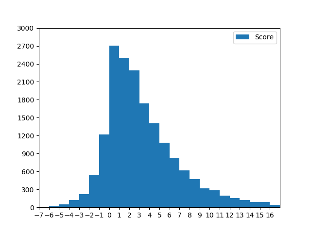

# WeChat-Sentiment-Analyzer
This is a project from BJUT which is about analyzing sentimental data from an official Account named BeiGongDaWeiShengHuo.It counts every individual comments and evaluate their emotion level with score standardized. 
## Result
* data.scv --------- origin data (total 17390)
* cuted.txt  ---------- seperate  sentences to words
* cuted_withAttri.txt ---------- seperate sentences to words with attribution
* senti.scv --------- comments' sentiment score (total 17390)
* pic.png ----------visual distribution

## Demonstration
[video](https://www.bilibili.com/video/av57655301/)
## Acknowledgements
### Sentiment analyser from `chaoming0625`
https://github.com/chaoming0625/SentimentPolarityAnalysis
### words divider from `lancopku`
https://github.com/lancopku/pkuseg-python
